# Hi, you are reading CD3's weekly progress reports :)
by Wanlun Ding, TDF fall 2023, MDes'24

## Table of Contents (by week)

- Week of 08/31/2023:
  - [Report 1](https://github.com/Berkeley-MDes/tdf-fa23-wanlun-ding/edit/main/README.md#report-1---week-of-08312023)

- Week of 09/06/2023
  
  - [Report 2](https://github.com/Berkeley-MDes/tdf-fa23-wanlun-ding/edit/main/README.md#report-2---week-of-09062023)

- Week of 09/14/2023
  
  - [Report 3](https://github.com/Berkeley-MDes/tdf-fa23-wanlun-ding/edit/main/README.md#report-3---week-of-09142023)

- Week of 09/21/2023

  - [Report 4](https://github.com/Berkeley-MDes/tdf-fa23-wanlun-ding/edit/main/README.md#report-4---week-of-09212023)

- Week of 09/28/2023

  - [Report 5](https://github.com/Berkeley-MDes/tdf-fa23-wanlun-ding/edit/main/README.md#report-5---week-of-09282023)

- Week of 10/05/2023

  - [Report 6](https://github.com/Berkeley-MDes/tdf-fa23-wanlun-ding/edit/main/README.md#report-6---week-of-10052023)
 
- Week of 10/12/2023

  - [Report 7](https://github.com/Berkeley-MDes/tdf-fa23-wanlun-ding/edit/main/README.md#report-7---week-of-10122023)
    
- Week of 10/19/2023
  
  - [Report 8](https://github.com/Berkeley-MDes/tdf-fa23-wanlun-ding/edit/main/README.md#report-8---week-of-10192023)

- Week of 10/26/2023
  
  - [Report 9](https://github.com/Berkeley-MDes/tdf-fa23-wanlun-ding/edit/main/README.md#report-9---week-of-10262023)

- Week of 11/02/2023
  
  - [Report 10](https://github.com/Berkeley-MDes/tdf-fa23-wanlun-ding/edit/main/README.md#report-10---week-of-11022023)

- Week of 11/09/2023
  
  - [Report 11](https://github.com/Berkeley-MDes/tdf-fa23-wanlun-ding/edit/main/README.md#report-11---week-of-11092023)

---   
## Report 11 - Week of 11/09/2023 

### Assessment & Reflections

This week was marked by the exciting opportunity to present our projects. Witnessing the creativity and innovation in others' projects was truly inspiring, providing fresh perspectives and ideas for future endeavors. The feedback received was invaluable, particularly the positive comments on the engaging video, well-constructed welcome message, and effective exploration of the LLM model. It's encouraging to know that these aspects resonated positively.

Constructive feedback is a crucial aspect of growth, and I appreciate the insights shared about information repetition in the LLM. Taking this feedback onboard, I plan to enhance the user experience by addressing this aspect for smoother interactions. Additionally, the suggestion to incorporate captions for clarity in video presentations is insightful and will be considered for future improvements, aiming to make our content more accessible and user-friendly.

We also had the privilege of a guest lecture by Mohite Bhoite, where he showcased his personal projects involving Particle Photon boards. The session was enlightening, demonstrating these boards' diverse opportunities for creating interactive desktop installations. The exposure to such practical applications broadened my understanding of hardware possibilities and sparked ideas for future projects.

### Speculations

In the context of the guest lecture by Mohite Bhoite, I see exciting opportunities for our final project. Integrating hardware design elements, inspired by the diverse possibilities demonstrated, could add a tangible and interactive dimension to the final project work. This might involve creating responsive and dynamic elements, enhancing user engagement, and storytelling aspects of our project. The aim is to explore how Particle Photon boards can elevate the overall user experience by seamlessly blending digital and physical elements in our final project.

---   
## Report 10 - Week of 11/02/2023 

### Assessment & Reflections

This week, I had the opportunity to present my mini designer twin project, which harnesses ZeroWidth's power to create an interactive portfolio. It's designed for professional use in interviews and networking, offering a personalized conversation with a virtual assistant. While I had some comfort with the UI interface, my knowledge of LLM was limited, and I knew I was facing a Triceratops or Platypus level of challenge.

To overcome these challenges, I set out to teach my intelligence how to answer specific questions, adopt my tone, and provide relevant information. My journey started with simple instructions, including a welcome message and clarifying the system's roles. These roles encompassed an assistant, career coach, and self-branding bot, each with a distinct tone. Although the system effectively communicated these roles, I aimed for more subtlety by avoiding giving users my exact instructions.

As I delved into information management, I organized knowledge sets and chunks by content with a task-oriented approach, addressing the challenges of linking limitations. I noticed that my AI experienced an identity crisis due to slow updates when prompted to personalize responses with variable modifications. This prompted me to reassess my approach.

To fine-tune my AI's responses, I adjusted the temperature settings. While a setting of 0.2 provided precise answers to specific questions, it struggled with broader inputs. On the other hand, a setting of 1.7 generated incoherent responses. The sweet spot was at 1.1, offering relevant answers with a touch of improvisation.

### Speculations

In terms of speculation, I anticipate the development of chat interfaces that mimic human-like communication styles and ponder alternative designs for LLM. Privacy concerns come to mind with the fine-tuning of models. The balance between individual needs and sensitive data capture needs careful consideration from an engineering perspective.

One thought-provoking question that arose is whether we should be held accountable for the biases present in digital twins. Also, there's a risk of overreliance on digital twins as shortcuts, potentially hindering our own thinking processes. Exploring the capabilities and responsibilities of digital twins in LLM design is an avenue I'm eager to pursue further.

---   
## Report 9 - Week of 10/26/2023 

### Assessment

This week, we moved forward to project 4 with a great introduction to the tool ZeroWidth led by Peter Binggeser. The project's goal of creating mini versions of oneself using large language models is both intriguing and promising. It was evident that Peter understands how these models work and how they can be customized for specific applications. The concept of configuring GPT-4 to acquire individualized knowledge and communication styles is an interesting practical application as well as a great opportunity to interact with the technology.

The three phases of language model development discussed during the meeting provided a structured approach to harnessing the full potential of these models. It was particularly enlightening to learn about the pre-training, structured data, and fine-tuning phases, each contributing to the model's ability to perform specialized tasks.

To better help familiarize myself with the tool, I took notes of the different components below for planning out the coming project:

  - üñ• _**Workbench**_
refers to the tool that allows users to customize and interact with language models to create intelligent solutions for various tasks.

  - 🧠 _**Intelligence**_
refers to the customized behavior or capabilities of the language models within the workbench. It involves providing specific instructions to the language model, injecting variables, and fine-tuning its behavior to make it useful for particular applications. This intelligence is designed to go beyond what standard, off-the-shelf language models can achieve.

  - üóÉ _**Knowledge Sets**_
are collections of information or data that enable language models, including off-the-shelf models, to have a deeper understanding of a subject or access proprietary information. These knowledge sets are used to enhance the capabilities of the language model and can be tailored to specific use cases, allowing the language model to provide more detailed and context-specific responses.

  - 🤖 _**Apps**_
refer to applications or interfaces that are built around the customized intelligence created using the workbench. These apps act as a layer on top of the language model, providing an API for developers to integrate the customized intelligence into client-facing or internal tools. They allow for the practical implementation of the customized language model in various products or services.

  - 🤖 _**Tokens**_
are standardized units of text used for analysis within language models, which can be represented by integers or numbers and serve as the fundamental building blocks for language models to process and understand text. Language models do not analyze words directly; instead, they break down text into tokens. Each word or part of a word, along with punctuation and spacing, can be represented as one or more tokens.
    - Understanding tokens is crucial because they directly impact how language models process and interact with text. It affects how the model manages the context of a conversation and remembers previous interactions. Language models have limitations on the number of tokens they can handle in a single interaction, which is why managing token usage effectively is important.
    - Effective token management involves deciding what information to include in a conversation and how to allocate tokens to achieve the desired behavior from the language model. Few-shot learning is also mentioned, which is a technique where the model is provided with just a few pieces of information to answer a question rather than relying on an extensive structured database or dataset.
    - In the meeting, Peter discussed how knowledge sets can help reduce the number of tokens used. Peter mentions breaking down the syllabus into smaller segments to save on tokens, and the system is designed to pull in relevant information as the conversation evolves. The overall theme is that understanding and managing tokens are essential for efficient and effective communication with language models, especially when dealing with limited token capacities.

Below are some screenshots that document my process of working with ZeroWidth:

- I customized the welcome message of the chatbot.
  - 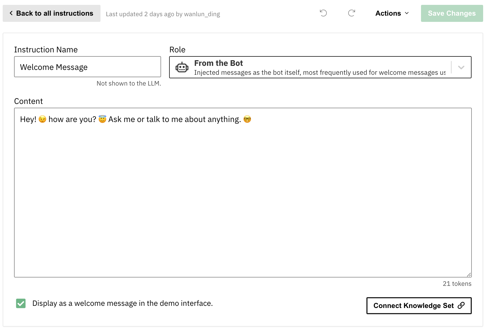
- Adding variables:
  - 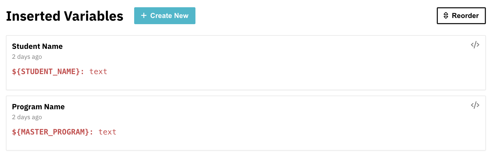
- Learning about temperature and randomness:
  - 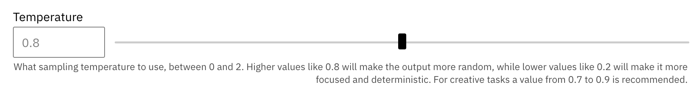
- After publishing my first version of the intelligence, I encountered errors in the conversational interface.
  - 

### Reflections

The meeting shed light on the vast possibilities of language models and their applications in conversation and creating AI-enabled devices. Peter's demonstration of creating a chatbot and an AI-enabled device showcased the immediate practicality of these models. Additionally, the potential use of language models in building conversational portfolio pages and hardware devices is a compelling concept.

The discussion on tokens, context windows, and managing the use of tokens was particularly enlightening. It highlighted the intricacies of effective communication with language models and the importance of optimizing their usage. Furthermore, the introduction of Knowledge Sets and Vector Databases offered a novel approach to encoding and searching for information, moving away from traditional keyword-based methods.

### Speculations

The project can potentially revolutionize how we interact with language models and AI. As the team delves deeper into the development and customization of GPT-4, it is likely that we will witness the emergence of more practical applications and innovative use cases.

The concept of a mini version of oneself capable of answering questions about personal behavior is exciting. It opens up possibilities for personalized AI assistants and educational tools. Introducing Knowledge Sets and Vector Databases may lead to a paradigm shift in information retrieval and management, making it more efficient and user-friendly.

The development of the Workbench and its components may also become more refined, offering users greater flexibility and control over their language models.

---   
## Report 8 - Week of 10/19/2023 

### Assessment & Reflections

It has been a fruitful week as we moved towards the final presentation of Project 2. In our "Build Your Garden" group project, we've delved into the intricacies of designing a digital ecosystem with two Photon boards to address our concern about climate change through a small-scale solution. This journey has been enlightening and taught me valuable lessons about building electronics with the concept of the digital ecosystem. 

Assessing the state of our work, I'm proud of the progress we've made in building the initial sensor-embedded board and developing code to read real-time data from environmental sensors. We've also successfully established a connection between the Photon board and the Unity-powered interface. Our ability to grow plants in Unity through interactions with physical sensors is a significant achievement.

### Speculations

Looking ahead, I imagine the future direction for tools like the Photon board and digital ecosystems is incredibly promising and interesting to explore for myself. Given the rapidly changing landscape of technology, I believe these tools will play a crucial role in addressing environmental challenges. The integration of cameras and additional environmental sensors, coupled with open-source plant classification algorithms, holds the potential to greatly improve how we interact with and monitor our natural surroundings.

As for the future direction of our work, I envision a digital ecosystem that enhances the first device's capabilities and incorporates multiple plant-specific touchpoints. These touchpoints will allow users to monitor their favorite plants and visualize the condition of their garden's plants based on real-world location data. This dynamic and interactive approach can help us better understand and communicate with our natural ecosystem, bridging the gap between the digital and physical worlds.

---  

## Report 7 - Week of 10/12/2023 

### Assessment & Reflections
In our group project, we've made progress in several aspects in the past week. We began the process of crafting a code script for the Photon 2 board, focusing on connecting it with sensors and reading data from these sensors. This experience has been a learning curve, but it's been instructive to witness how the hardware interacts with the digital code.

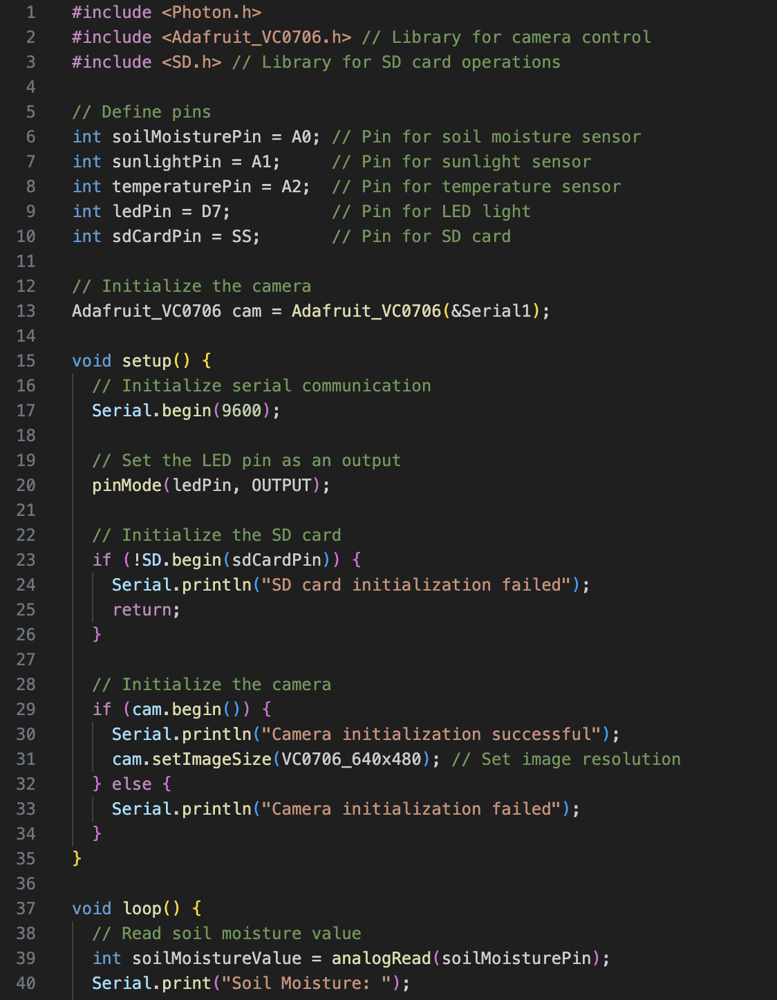

Additionally, we've been experimenting with building interactions in Unity. We initially tried to implement this in Arduino, with which our group members had more experience. This shift has given us more flexibility in crafting immersive interactions, but we are excited to learn to implement with Photon instead. We've also been finding plant recognition algorithms that we can integrate into our project. The ultimate goal is to develop these algorithms ourselves based on plant samples found in Berkeley. 

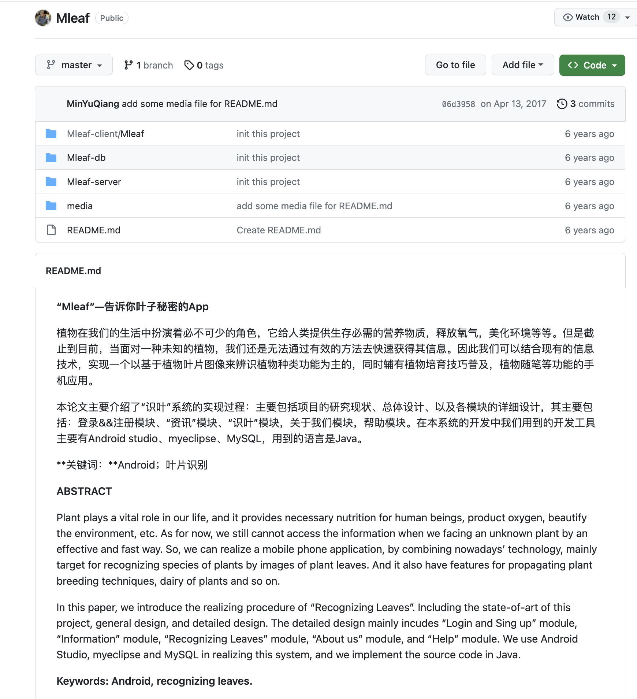
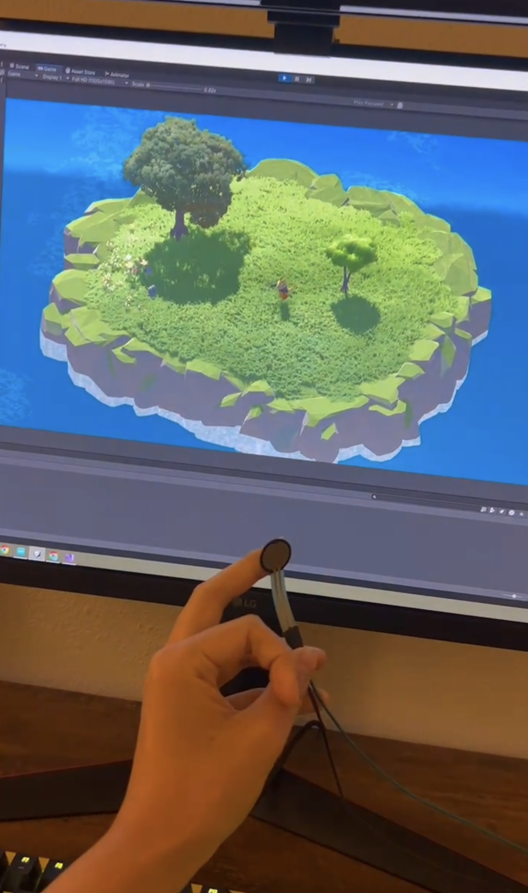

Our ongoing focus lies in further refining the narrative associated with our prototype. We are particularly intrigued by the concept of a speculative design fueled by a climate apocalypse narrative, in which our prototype plays a pivotal role in safeguarding plant data, preserving species, and enhancing adaptability.

### Speculations

I recently came across some interesting projects involving connected hardware. I would love to dive into the potential of these projects and build something of my own in the following weeks.

---    

## Report 6 - Week of 10/05/2023 

### Assessment & Reflections

Since our group formation and the start of our work sessions in the past week, I've been exposed to numerous inspiring ideas about creating projects involving hardware, a domain I had never worked with before. For instance, when hearing about the animal enrichment prototype, I realized that even though I worked on this topic before, I hadn't explored related projects or concepts integrating electronics, especially those that are responsive.

Similarly, within my group project, I was pleasantly surprised by one of my teammates' adeptness in building wearables, which she found to be a relatively straightforward and easy process. Given the tools at our disposal, it seems more important to generate innovative ideas and figure out the assembly process into a unique creation, once we've grasped the basics. 

This approach differs significantly from my prior experiences, which often started with careful planning in advance. In this entirely new area, I found the importance of early and extensive experimentation. Collaborating with my team has been enjoyable, and I've gained many insights by looking through impressive projects by others.

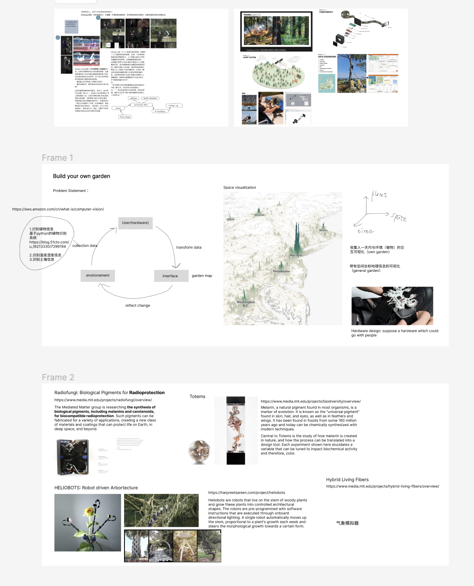

### Speculations

I wonder how to build a more complex hardware-enabled digital ecosystem and its differences from what can be built with the Photon 2 development board and other materials in the kit. 

---    

## Report 5 - Week of 09/28/2023 

### Assessment & Reflections

Over the past week, our focus has been on exploring various ways to utilize the Photon 2 IoT development board. We expanded our experimentation by incorporating external LED lights and resistors, along with corresponding codes, to experiment with different interaction methods using the tool. Initially, I followed the example positions provided in the tutorial when connecting the wires, which was not working in the beginning. Thanks to the guidance of Clara and Sudhu, I gained a clearer understanding of how to make the connections based on the labeled components.

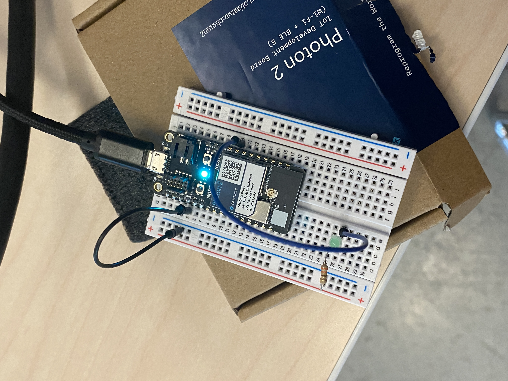   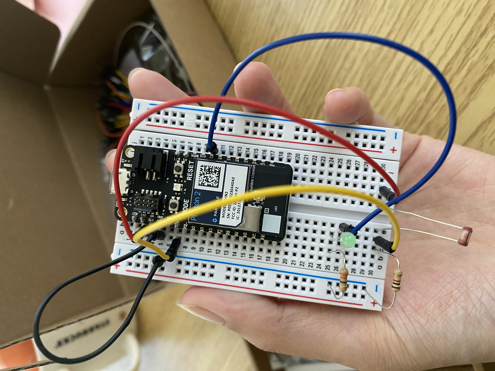

Subsequently, I delved deeper into understanding the connections with TJ's drawing of a circuit diagram. TJ also explained how values were affected and displayed in response to the presence of the resistor. The diagram brought back some physics class concepts from long ago and helped me grasp the practical aspects, providing a solid rationale for the specific connections we were making. So I was hoping to look up circuit drawings of Photon 2 but didn't find many examples. However, by looking at the block diagram provided by Particle, I was able to get started with learning the components and relationships. 

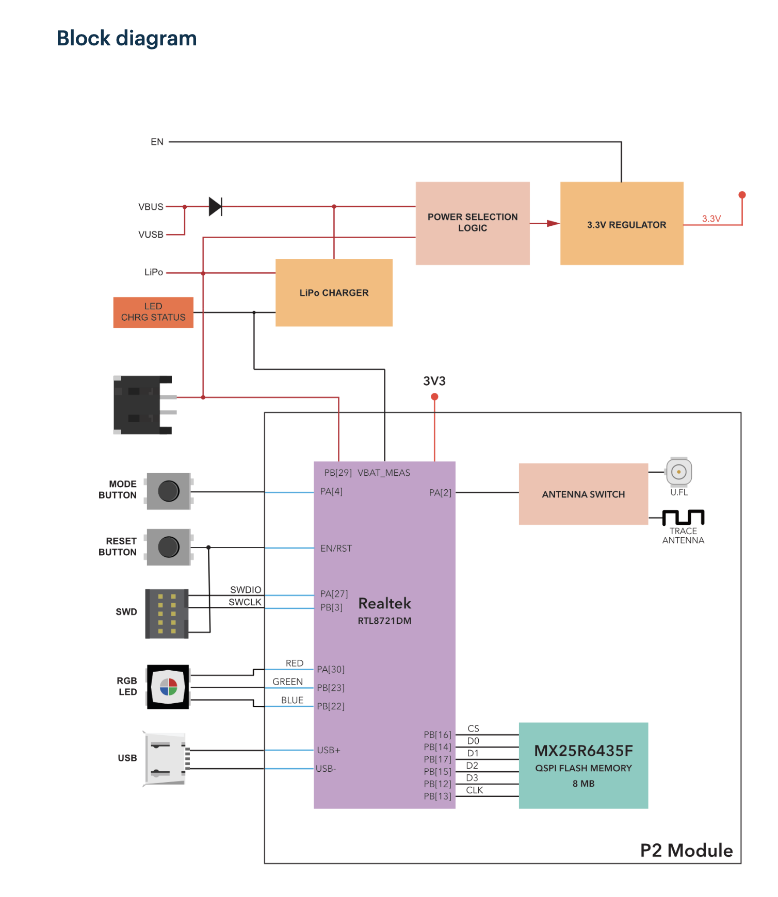 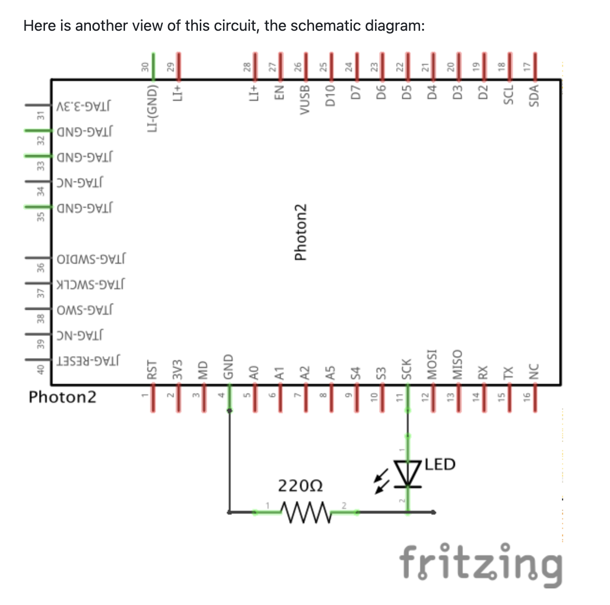

### Speculations

I found inspiration for speculating about the hardware tool's potential applications and future directions through two class activities from the past week. The first was our guest speaker, [Adrian Freed](http://www.adrianfreed.com/), who shared his insights and experiences with the [E-textile Swatch Exchange](https://etextile-summercamp.org/swatch-exchange/). The second source was the project ideation session centered around creating real-world solutions in various fields using the Photon kit. The creatively curated documentation of the E-textile Swatch Exchange was especially inspiring in its very format, but it also provides insight into how the hardware can be combined with different materials and experimented with different ideas.

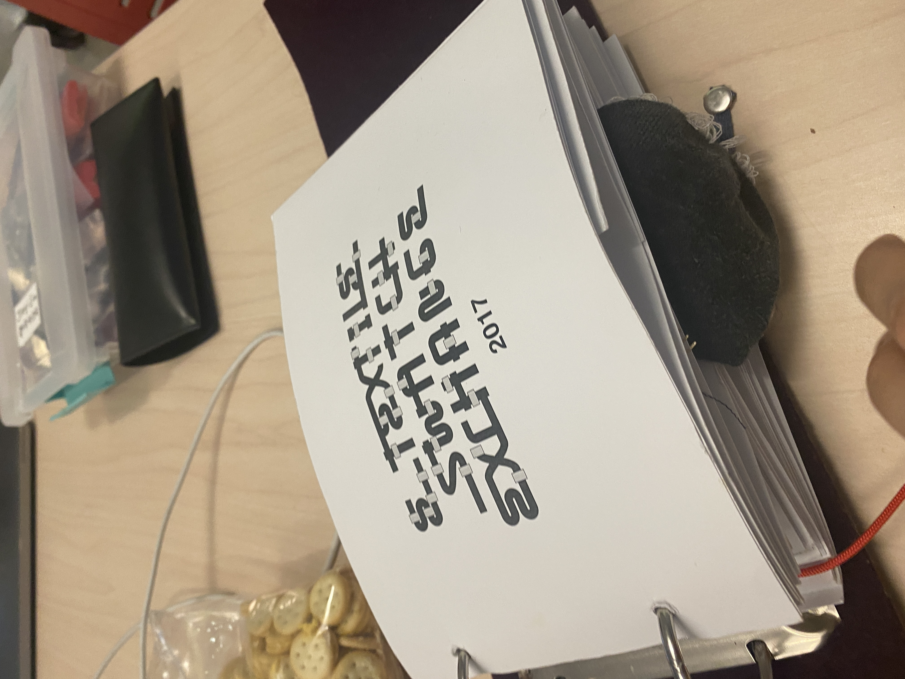 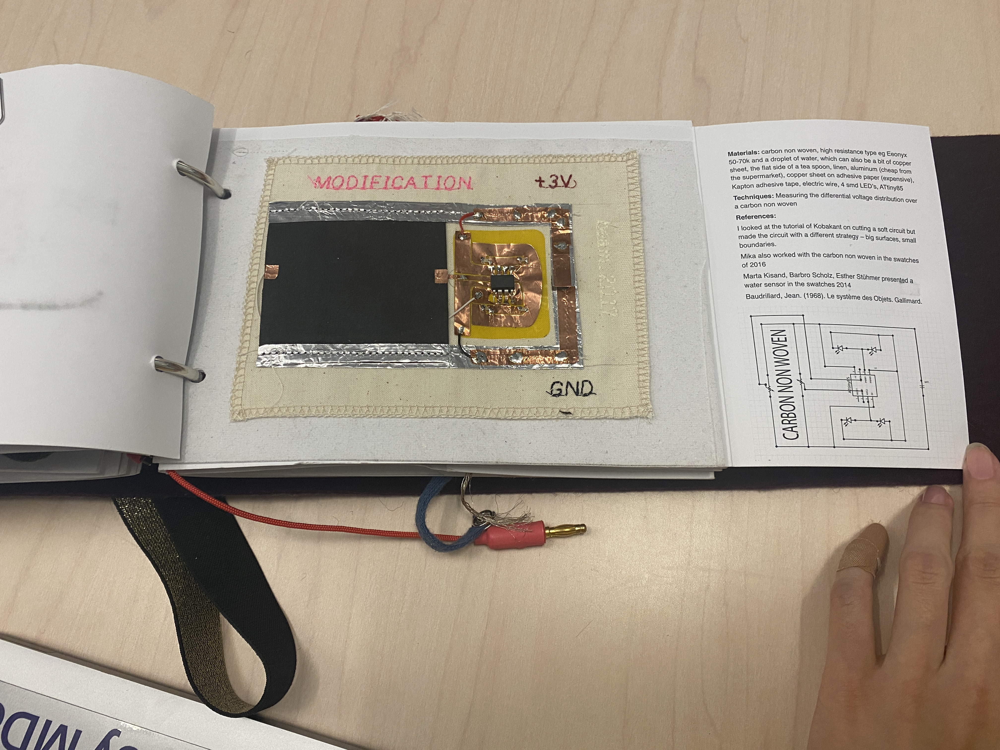  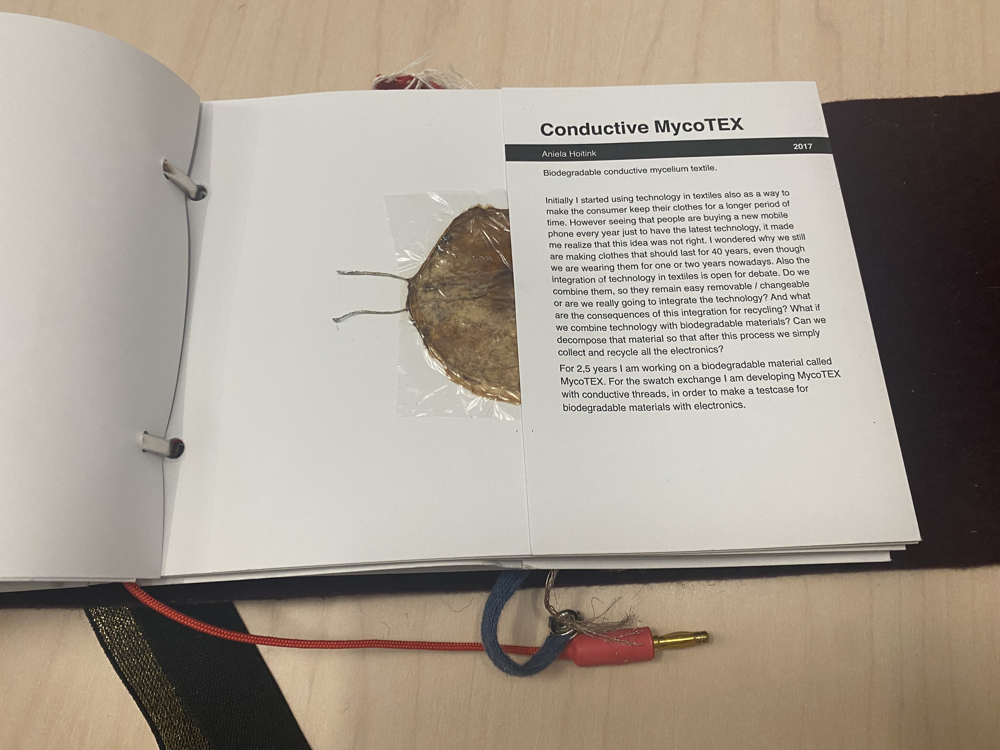

During the project ideation session, the initial request was for us to brainstorm solutions across various industries. At first, I was a bit confused because I attempted to restrict my ideas to what I believed could be implemented with the hardware tool. However, as I began to explore a wider range of concepts with my teammates, I realized that I had limited knowledge about the tool's potential applications, and therefore there was no need for me to impose restrictions. Later, when the project preferences form came out, I was pleasantly surprised by TJ's use of chatGPT to provide detailed prompts and examples of how the technology could be utilized. This revelation expanded my understanding of the tool's capabilities and the diverse ways it could be harnessed.

---
    
## Report 4 - Week of 09/21/2023 

### Assessment & Reflections & Speculations 

🥳 Kickstarting the new phase of Project 2 - digital ecosystem, I was very excited about getting into the physical connected with the digital and getting my hands on hardware I had no experience with. This was particularly exciting for me, given my longstanding interest in cyborgs, wearables, and IoT technologies.

🤩 Since we were mainly working on setting up the Particle Photon 2 IoT Development Board, I would like to take this entry to delve deeper into understanding the concept of a digital ecosystem and gain insights into the functioning of microcontrollers. 

[Simply showing off my connected Photon 2 board below]

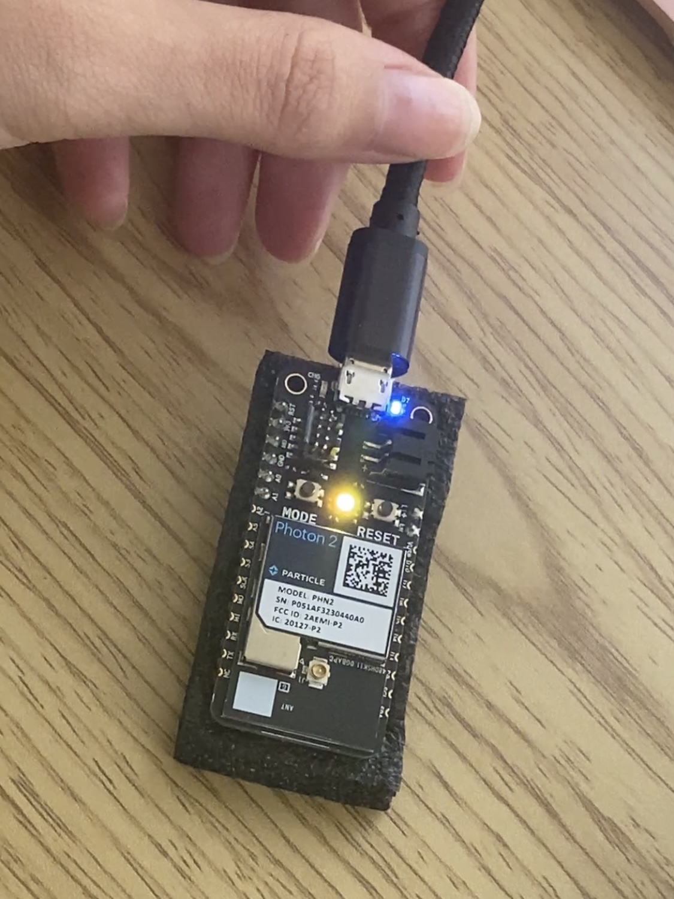   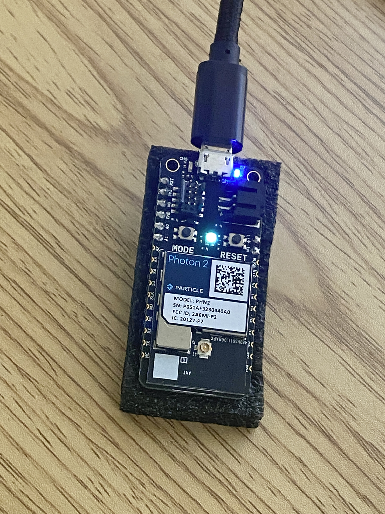

🍄 _**Digital Ecosystem**_: Despite how frequently I use the two words "digital" and "ecosystem", I had never heard of the pair. After the introduction in class, I decided to look into this realm, given my past theoretical focus. 

- I came across this article ["Everything you need to know about Digital Ecosystems"](https://www.imd.org/reflections/digital-ecosystems/#item1), which discussed it more from the business perspective, according to which the digital ecosystem is a complex network involving people, businesses, and systems that use technology to interact. It integrates physical devices, data, and apps, enabling seamless interactions. Unlike traditional business models, digital ecosystems encourage networked collaboration and rapid adaptation. These ecosystems find applications in companies (e.g., Meta, Amazon), government agencies (e.g., MyData for transparency), and individuals (e.g., healthcare apps). Key components include centralized databases, SaaS for data sharing, APIs as the backbone, and platforms as central hubs.

- From a more academic research-focused and critical perspective, this journal article ["Digital ecosystem: The journey of a metaphor"](https://www.sciencedirect.com/science/article/pii/S2666378323000090#s0050) underscores the pivotal role of metaphors in comprehending digital nature, with a specific focus on the "digital ecosystem" metaphor in the context of digital political economy. The author highlights how this metaphor has been crucial in lending legitimacy to the idea that digital technology can emulate biophysical ecosystems, suggesting that data and digitalization alone can tackle environmental challenges. Moreover, the widespread adoption of the "digital ecosystem" concept has shifted the emphasis towards technological solutions while diverting attention from political aspects in environmental policy and business strategies. The concept promotes technological optimism while concealing critiques of capitalism, thus shaping perceptions and actions in the digital and economic realms in complex ways.

I would like to continue the research and look for a more experimental approach to engage with the concept and find in the midst of these ways one in which I would like to develop my project. 

---

## Report 3 - Week of 09/14/2023 

### Assessment & Reflections

This week has been a dynamic and transformative period for our cohort's individual projects, as we worked intensively toward the completion of Project 1. One challenge was that I found myself experimenting with basic operations during the first few weeks before realizing the need to pivot and come up with new design concepts in the past week. I was surprised at how much and how fast I could learn in a short period of time when prompted to do a project. Even though I have been looking at some beginner tutorials and getting used to the interface, it wasn't until working on the project this week that I really became more familiar with the commands and their actual use.

üí° I was inspired by the various projects our cohort came up with, from a 3D printed hollow spheric phone stand, and a smoothly curved laptop stand, to a large architecture-like bowl consisting of several pieces inserted into one another. Their early initiation of the design process allowed them ample time for testing and evaluation, ultimately leading to more refined outcomes. Additionally, their diverse approaches to designing homeware and tools tailored to their daily needs showcased the versatility of their creative thinking. 

To set my own project challenges, I decided to come up with a 2D phone stand design and build from scratch to help me understand the fundamental logic and step-by-step building process of Grasshopper. However, I didn't yet have a deep understanding of what computational design can achieve other than the complex examples and architectural projects shown in class. Therefore, thinking mostly about customization based on parameter changing, I borrowed the same concept from the given design file to design 2D physical components that can be put together. To start with the pieces needed for support, I drew a cat-shaped stand and refined the idea with more sketches in Illustrator. I also made a paper mockup but couldn't really figure out if the design would work in reality as I'm not sure how the pieces would support each other. 

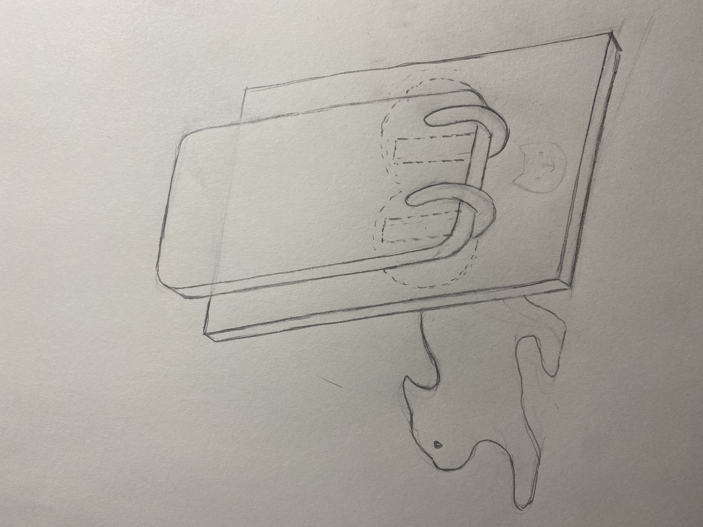   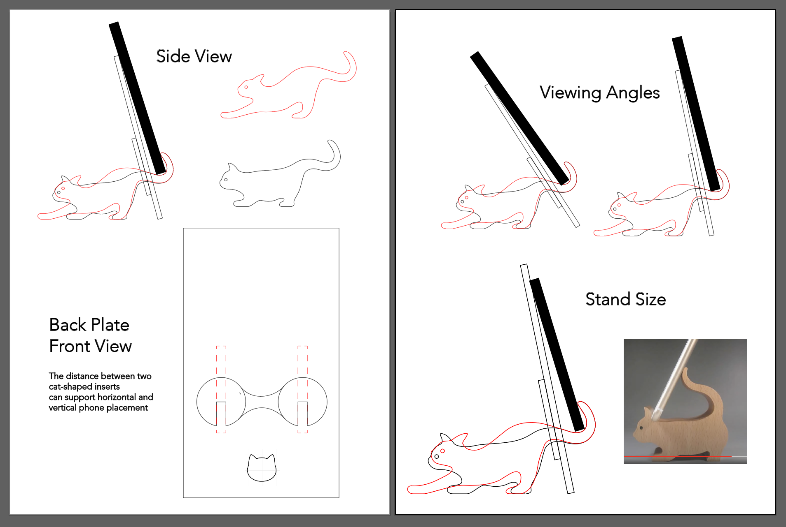

Diving into designing with Grasshopper, I was quite overwhelmed at the very beginning and had to look for tutorials on how to make similar designs. Most of the simple product designs focused on building computing-generated structures based on simple geometries rather than pre-designed shapes like the cat illustrations I had. I traced the cat shapes in Rhino first and started adjusting the geometries to build each piece of the stand. This required me to shift between thinking in 3D forms, 2D shapes, and individual points seamlessly. extracting specific numeric values from points on a surface involved not only finding the correct command but also identifying the precise value to utilize. To maintain clarity in my workflow, I relied on notes at various stages to document and remind myself of each step.

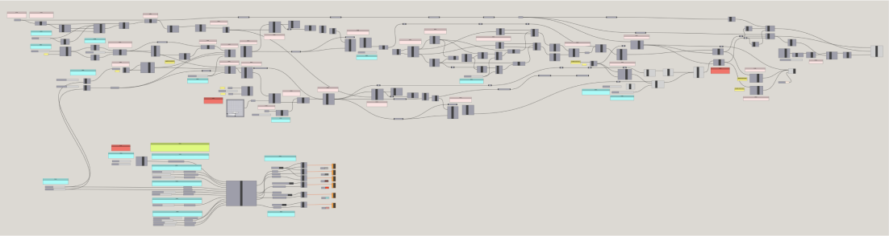

To simulate the phone placement, I imported the phone model into the provided design stack. There are two key parameters that can be adjusted to tailor the simulation: the vertical and horizontal positioning, in addition to the viewing angle in the original file. In addition, I can modify the width and length of the phone model, according to which the dimensions of the rear surface of the phone stand will align.

   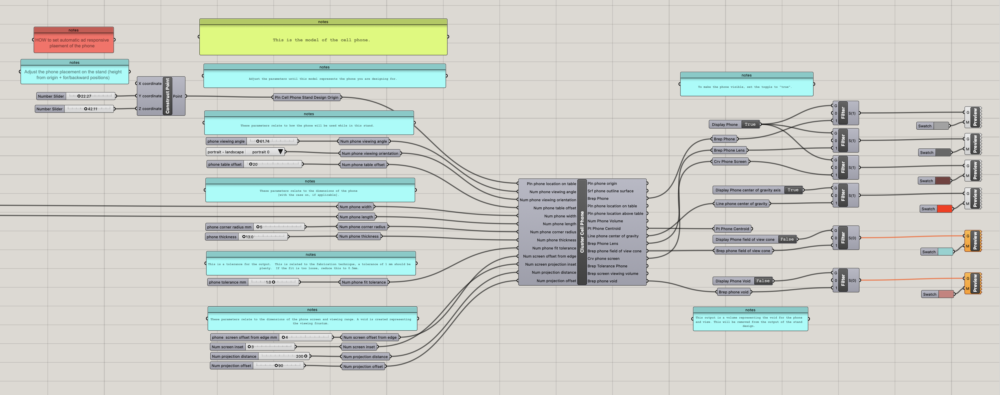

The back plate's dimensions can be adjusted with tolerance sliders, adding to the phone's original dimensions. I can also fine-tune the back plate's angle and the distance between the two cat stands. However, these adjustments are necessary due to design limitations, as these parameters were not initially linked to the phone's angle and center of gravity and cannot automatically optimize themselves. The corner radius is also available to adjust for aesthetic purposes. There are also sliders that control the inserts' shape, size, and the cable hole's scale. Two hollow rectangular spaces accommodate cat tails, with extension direction determined by negative maths in Grasshopper.

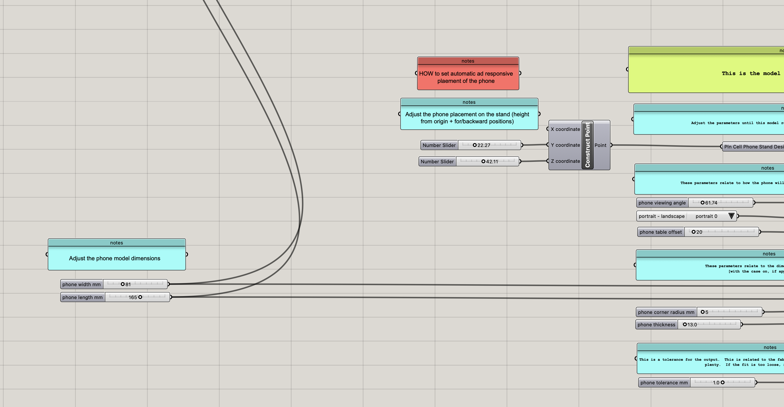
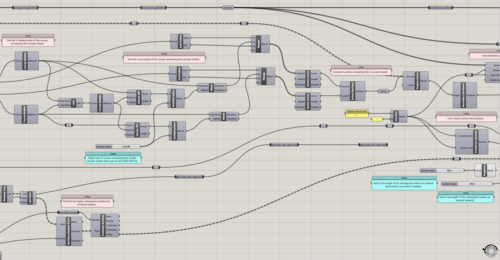   

I employed red notes to highlight lingering questions and uncertainties. These questions underscored the challenges of comprehending mathematics, particularly when dealing with interconnected elements back and forth. 

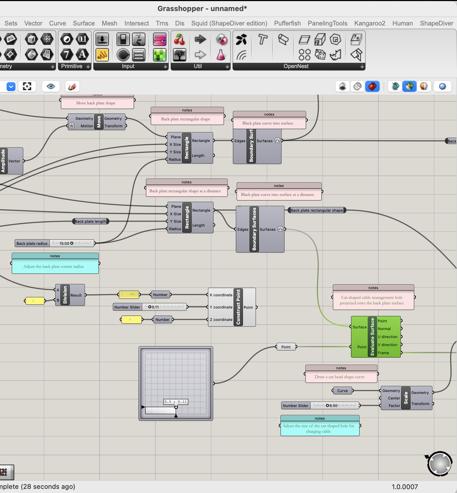  

The exported 2D Illustrator file contained some errors that could be easily fixed. During the fabrication process, I had to make several iterations, tweaking certain parameters in an attempt to assemble the design, but I still couldn't ensure the stability of the stand. I suspected that this problem might have originated from the initial design concept. While the digital tools allowed the geometries to fit together, they could not provide sufficient information about the effectiveness of the supporting structure.

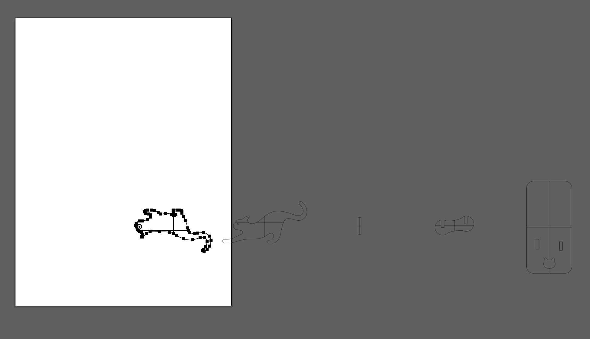   
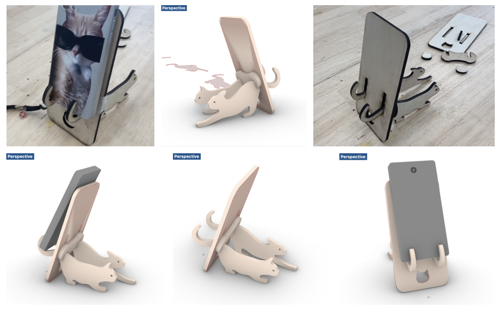

Reflecting on my experience, I found that working with Grasshopper involved more geometric and logical configurations compared to building with visual aids in Rhino. While I was able to make progress through trial and error, I realized that I tended to focus too narrowly on individual components in Grasshopper rather than viewing the entire project as a holistic system design effort. For my future endeavors in computational design, I aspire to develop a more holistic way of thinking that enables me to better harness these tools for creative purposes.

### Speculations

In terms of our work, I believe we should continue to prioritize adaptability and flexibility. The past week has shown us how quickly project requirements can change, and our ability to pivot and adapt will be essential in staying competitive and relevant in the industry. Additionally, we should strive for early project initiation and thorough planning to allow for iterative design and testing, as demonstrated by successful team members like Roshan, Charon, and Fareha.

I have identified several areas where I aim to enhance the design:
- Refine the stand's mechanism and components to ensure it can securely support various phone models.
- Explore building the project without relying on the Pufferfish plug-in or refining my workflow using it.
- Investigate the possibility of creating a workflow that can incorporate supporting stands with different shapes, perhaps customized with other animal patterns.
- Experiment with designing a 3D model using a single extruded car shape to hold the phone.

**Futures of the Tools**

The Nvidia Omniverse Connector plug-in allows Rhino and Grasshopper to function seamlessly within Nvidia Omniverse's real-time simulation and virtual collaboration platform. Multiple stakeholders can work with their own preferred tools and workflows while accessing and revising the shared live-sync model generated by group effort. This collaborative approach, supported by the platform's rendering capabilities and compatibility across different design tools, has the potential to accelerate the design and engineering process. Moreover, Nvidia's AI expertise may produce AI tools for designing, optimizing, and automating tasks in Rhino and Grasshopper. This integration can also offer new 3D design and parametric modeling education possibilities.

---

## Report 2 - Week of 09/06/2023 

### Assessment & Reflections

🤔 The first week's progress focused mainly on adjusting the existing parameters in Grasshopper and understanding how the changes appeared in Rhino, which gave me a vague and simplified sense of what computational design could do. The second week was more fruitful in terms of grasping the system design in Grasshopper with [the walkthrough tutorial on Cell Phone Stand Design by TJ](https://www.youtube.com/watch?v=GHtWNAPiAoE) ...

🤦‍♀️ First, continuing in last week's 2D phone stand export, I examined and exported my customized design to Illustrator for laser cutting. After baking, exporting, and opening Illustrator files thrice upon not finding the lines, I finally figured out and got used to grabbing the exported objects from the far wild.

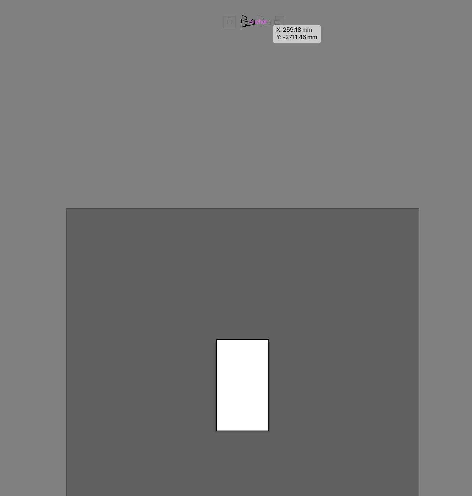

üìê Before proceeding with laser cutting, I noticed this tiny pointy part generated by my parameter input, which I felt unsure whether it would be able to cut safely and correctly and provide proper support for the other pieces of the stand. So I opted to cut the example file instead. However, I would still like to cut it after further experimentation with the parameters more since design failures might be more enlightening than getting the right result at this stage. Moreover, warnings of overlapping or broken structures and seemingly unfeasible or unusable parts could illustrate constraints and possibilities in design.

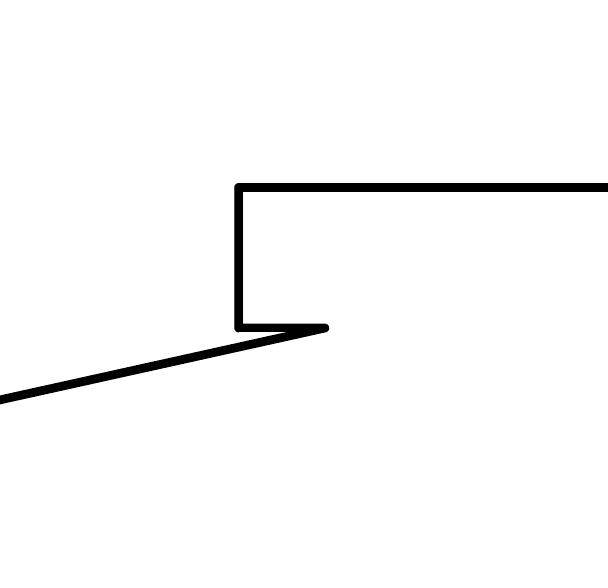  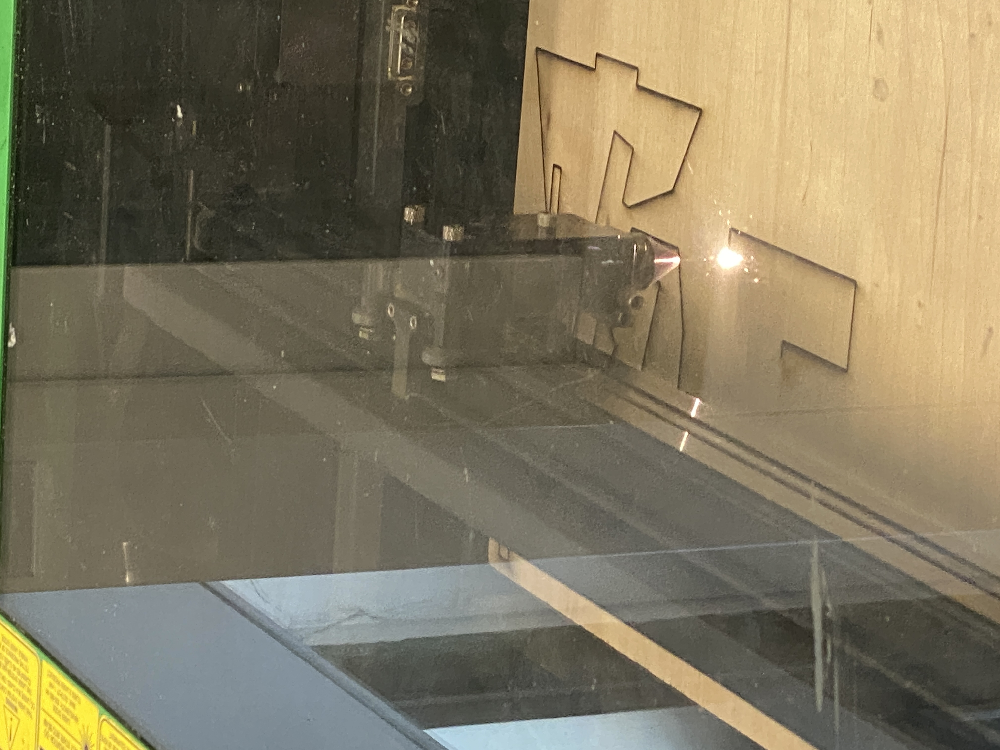

üìä Another inquiry I had was the production cost of an ideal phone stand. I looked up and used the "area" function to calculate the surface area of two phone stand designs given different parameters. Before comparing the "failed" design above with another version, I found myself increasing the height of the pointed parts in the second version. My primary goal was to achieve better visual balance, although I questioned whether this height adjustment had practical benefits, such as stability.

This led me to ponder how designers strike a balance between cost, usability, and aesthetics in computational design. I considered that the second version would use slightly more material than the first one and wondered how designers navigate such decisions.

While the 2D phone stand might not be the perfect example for addressing this complex challenge of the "unattainable triangle", I remained curious about the extent to which designers can rely on computational output and when they should step in to make manual adjustments.

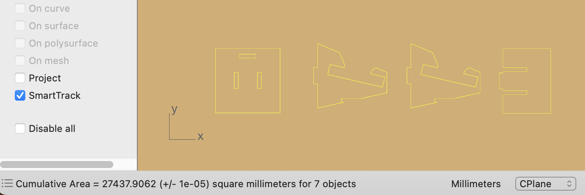`  
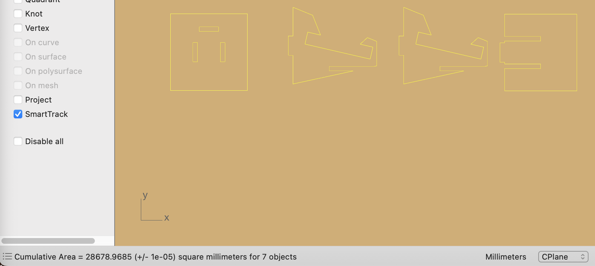  

üñ≤ The simple 3D phone stand file might serve as a more suitable case to investigate the balance, especially when I followed the tutorial to compare the sphere versus cylinder versions. Estimating the baked output's approximate volume by eyeing was hard, but I noticed that the cylinder's height and radius had the most significant impact on the result. However, if considering the stability factor, I couldn't tell if having higher back support in the cylinder version or making a wider base support in the sphere version worked better. The volumes can also differ more than in the 2D designs. 

Although the parametric design approach can be a lot more efficient in producing a usable design, given the established relationship between objectives and responses, I had yet to see how it could make the ideal decisions in such cases and what designers should do to achieve the balance. How can I embed a decision-making mechanism through designing the system in Grasshopper? 

  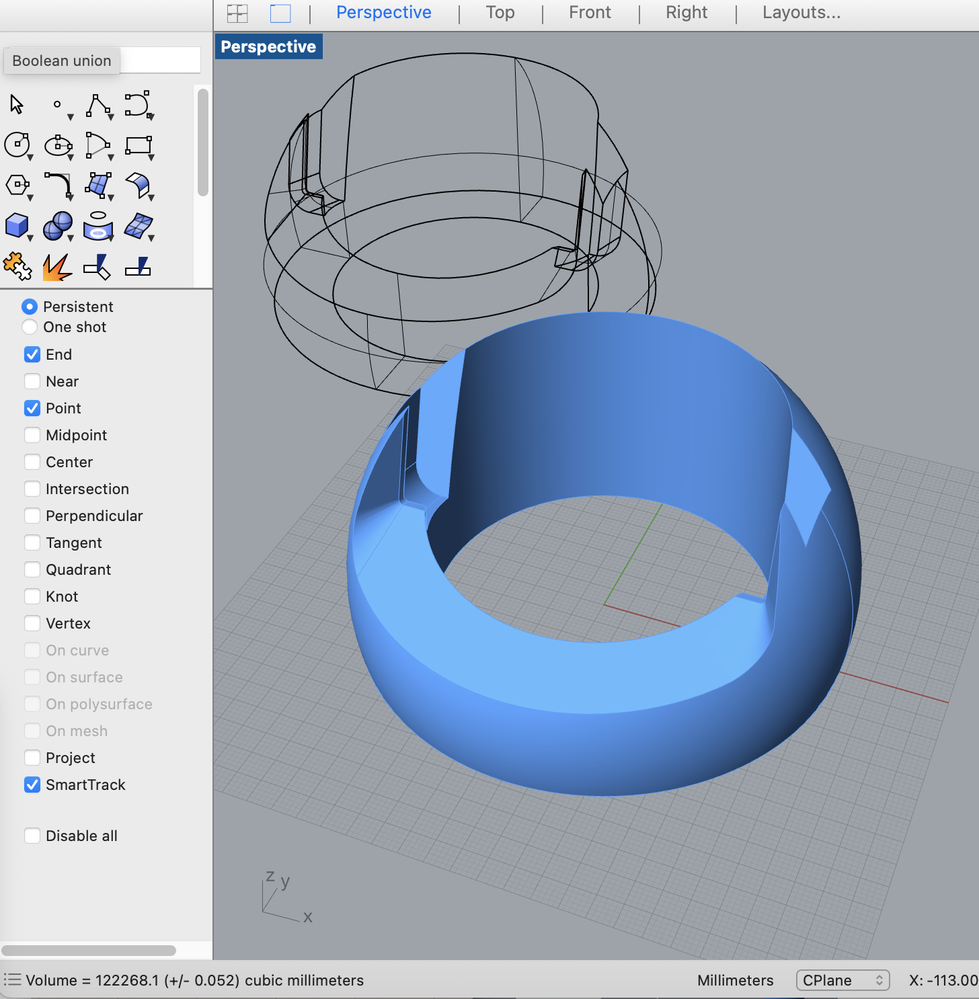
  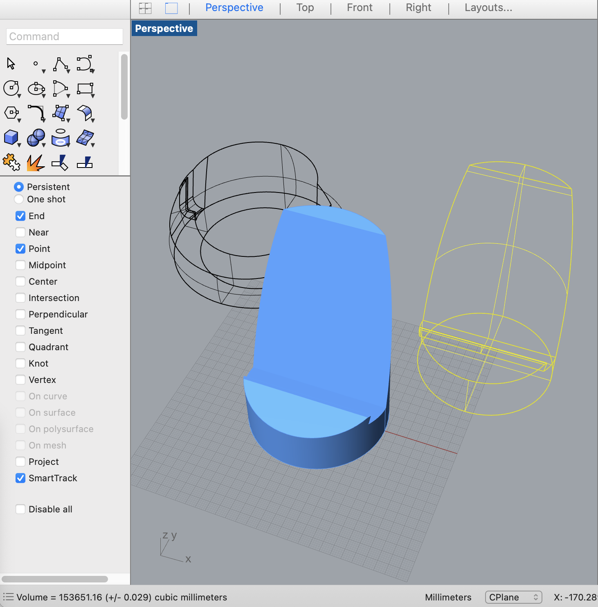

‚ùì Next step in figuring out the design of inputs: I would like to learn how to increase the recessed space for placing the phone horizontally. In the current version, there were only very shallow indents on the two sides to hold the phone. Once again, I was only eyeing and had doubts about usability before going into the actual printing. 

In addition, in the landscape version, the camera lens appeared to be suspended in mid-air, potentially indicating an issue with the phone's structural design. Unfortunately, I couldn't locate the source of this problem within the phone's design, as it worked out correctly with the portrait placement. 

I also wonder how to introduce the user context, like activity points, into the simple 3D phone stand design and how it would affect the design output. 

  

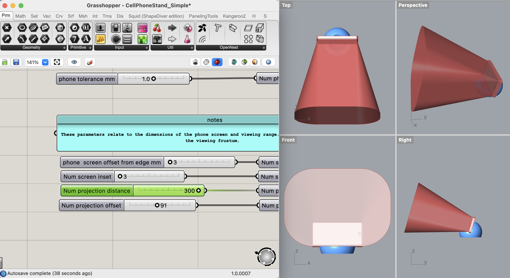

üè∑ Finally, I learned good practices from following the tutorial: duplicating an item multiple times throughout the system whenever necessary to maintain better visibility. Additionally, incorporating notes to explain the purpose of each section is another effective method for staying informed and quickly locating relevant information. Much like in coding, having a well-organized and documented system design can significantly boost productivity and efficiency.

### Speculations

1. _**Enhancements in Grasshopper and Rhino 3D:**_ As I continue my journey with these tools, I anticipate that they will undergo continual improvements, such as the incorporation of an AI assistant to aid users, especially beginners. Currently, both tools demand the memorization of numerous commands. But is it possible that in the near future, we'll have the capability to simply ask a chatbot for guidance, and have a series of commands seamlessly provided and executed?
   
2. _**Increased Focus on Practical Applications and Deeper Understanding of Computational Design:**_ While I've been primarily experimenting and learning so far, I'm excited about applying computational design to real-world challenges toward finishing Project 1.

   - I want to tackle complex design problems by leveraging the full potential of these tools, which could involve optimizing product designs for manufacturing efficiency.
   - The notion of striking a balance between aesthetics, cost, and usability fascinates me and will continue to be a main topic to explore in Project 1.
   - I'm drawn to designs that consider the needs and behaviors of end-users. For instance, how can I leverage parametric design to create ergonomic office products or design equipment in public spaces that encourage accessible social interaction?
   - Can the design output be modular for easier testing and evaluation? This is still a vague question to be composed more accurately, but I'm interested in how to design for a larger-scale system with very complex inputs, constraints, and intents.
   - 
3. _**Decision-Making Mechanisms:**_ Embedding decision-making mechanisms into designs intrigues me. For instance, if I'm designing a modular housing system, I might explore how computational design can help me generate layouts that maximize space utilization while adhering to local building codes and regulations.

---

## Report 1 - Week of 08/31/2023 

### Process Doc & Assessment

üï≥ In the first week, I delved into the realm of parametric design using Rhino 3D and Grasshopper 3D... 
At first, I couldn't navigate the files as I kept receiving this error message, which still popped up later even though I [looked it up](https://discourse.mcneel.com/t/error-loading-tutorial-files/157563). Thankfully, my cohort members helped me with bypassing this problem, but I'm still looking for a proper solution.

👀 I resized the table based on the desk at my home, adjusted the human figure to my height, and set the phone's dimensions and camera positions according to the iPhone 11 Pro Max model. I wonder what is a good practice to locate the precise data of the original phone design since I didn't find the information and had to search for Figma mockups and do hand measurements. 

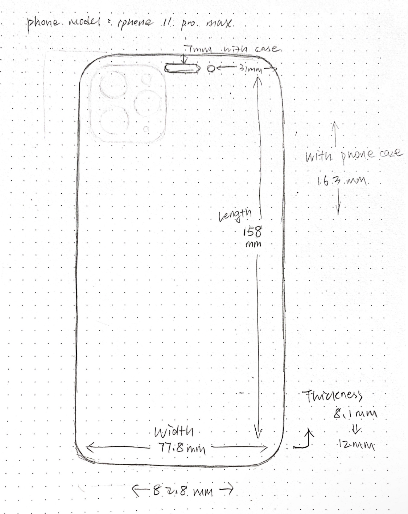

üö∂ However, I wasn't able to find the slider to move the phone on the table, so I turned to move the student's position instead.

‚ùó Another obstacle I encountered was when I edited the phone viewing angle, and the entire stand model was shown in red to indicate an error as the two identical holding pieces would break. I wonder why the rest of the pieces could not change to reflect the parameter adjustments and if this gap existed in the structural design. Moreover, I couldn't figure out what the phone screen offset from edge meant by changing the related number. 

:warning: The final laser-cut design resulted in misplaced, non-overlapped shapes and lines, which only happened after some slider adjustments. In addition, I could not find where and how to bake the 2D design after changes and doubted if I accidentally moved the outline. I wonder if this would affect the export to Illustrator and laser cutting.

### Reflections (what and how I learned)

🤯 Though having played with Rhino modeling a few years ago, I used it primarily for grasping 3D concepts rather than precision. This became evident when my attempt to export a design for laser cutting resulted in ill-fitting pieces back then. Reopening Rhino years later, I faced a steep relearning curve of the interface.
- I could not understand the blank viewports in the beginning, the unselectable geometries, and the baking concept until I read [this article](https://modelab.gitbooks.io/grasshopper-primer/content/1-foundations/1-1/3_talking-to-rhino.html) explaining how Grasshopper communicates with Rhino.

  - üç∞ _**Baking**_
is like turning a recipe into a dish. Grasshopper designs provide rules for Rhino to follow, but it doesn't actually create any real objects by itself. When you want to use Grasshopper-designed shapes in Rhino, like selecting, editing, or transforming, you must "bake" them. Baking is like taking a snapshot of your Grasshopper design and making it real in the Rhino world. Once you've baked something, it becomes part of your Rhino project and won't change automatically if you change your Grasshopper instructions.

🪩 Though I only tested the tools with ready-made sliders of parameters guiding the ultimate 2D and 3D designs, the project turned out more constructive when I took a step back to consider the qualitative decisions about parameters. 

- I questioned the elements making up the current context: the CellPhoneStand_all file included various basic components like the floor, table, student user, phone screen, camera, and lens view. These were assembled to create a functional stand for shooting videos. The central focus was on accurately representing the user's actions, considering how the student's body and the table's geometry interacted with the phone's lens view.
  
- By searching "qualitative computational design," I came across a study, [HUMANISING THE COMPUTATIONAL DESIGN PROCESS Integrating Parametric Models with Qualitative Dimensions](https://papers.cumincad.org/data/works/att/ascaad2016_003.pdf), that discusses social and cultural contextual aspects. This analysis prepared:
    > "Socio-spatial grammar for generating parametric solutions for contemporary tall residential buildings that encourage social interaction between families, while respecting their needs, lifestyles and context."
    
- To rethink the system of parameters while observing."how the current components are connected (without much understanding of how they are designed), I noted down a few components that could personalize the solution inspired by the article mentioned above and my real-life situation:

  - Design for multiple shooting perspectives in a confined space. For instance, I have an L-shaped desk at home that can support shooting from either direction (as illustrated below). Although the table's dimensions may not matter much, the room layout could affect the lens view depth and other camera components. How far or close does the user usually stay from the phone, given the limits of the room or the best shooting distance? The floor is set to be a regular rectangular platform whereas, in a real user scenario, there could be irregular layouts, furniture blocks, and other factors (e.g., the user starts a knitting YouTube channel but does not want roommates or parents to find out about the video shooting, thus needing to find a spot that allows the user to quickly stop and "cover the scene" when others ask to enter the room).
   
   
   - Consider more contextual data and user preferences. Where are the windows, and where does the best natural lighting come in? Is the generated design suitable for users with various difficulties in vision, mobility, etc.? Is the computational model powerful enough to inform such accessible design? Is it possible to lay the foundation for a further manually modified design intended for enjoyment beyond usability?

  - How is parametric design more or less suitable for designing different user scenarios compared to generative and algorithmic design? In what cases should I generate a collection of designs or seek one solution? How does the quantity of produced designs or the algorithmic process "in the black box" affect the ideal working method of evaluating results? I would revisit these questions after printing and laser cutting the designs and as I explore computational design and the 3D tools more.  

‚úÖ Next thing for gaining knowledge of Rhino and Grasshopper includes: 
- Learn the [Rhino](http://docs.mcneel.com/rhino/7/help/en-us/commandlist/command_list.htm) and [Grasshopper](http://docs.mcneel.com/rhino/7/help/en-us/commands/grasshopper.htm) command list and vocabulary for better communication and understanding (sources linked).

### Speculations (tools, work, and news)

🤖 As a neophyte, I (of course) asked ChatGPT about the parameters helpful for generating a good phone stand design. Here is a list in which I highlighted the design opportunities I missed. I would like to learn if and how Grasshopper can incorporate these factors. While I assumed the aesthetics-related ones would be more difficult for AI or computing to solve, I also wondered if the other aspects could be successfully translated into feasible numeric parameters. For example, when considering portability or easy assembly, should the design consist of smooth edges and corners so that users won't get hurt or experience damage to their belongings kept together with the stand? How does a designer communicate this consideration with the tools? 

1. User ergonomics and comfort
2. Table dimensions and stability
3. Camera angle and view
4. Lighting conditions
5. Phone model and size
6. Material and aesthetics
7. üèñ _**Portability and storage**_
8. üîå _**Cable management**_
9. Hands-free operation
10. Ease of assembly and customization
11. Stability and vibration damping
12. üõã _**Contextual aesthetics**_

üßô Furthermore, imagine if users can all adjust the parameters through a designed AI-powered interface without interacting with the complex tool and 3D print the product from home; how can they give feedback, and what feedback data are needed for improvements once they try it out? I researched and discovered the seemingly contradictory yet promising paring of a concept, "mass customization," through [this article](https://t.ly/cXR72). I was thinking more about design for a highly personalized fit, especially in the realm of healthcare, fitness, and everyday safety equipment. The applications can be more creative and aesthetics-oriented. But what does creativity even mean with computational design? Is leveraging computational design to design a medical device necessarily a less creative process than producing a fashionable keychain? For the final thought, please see some of my product findings below, all of which I appreciated and learned a lot from. 

[Nike's performance-enhancing 3D-printed sneakers](https://techcrunch.com/2018/04/17/nikes-vaporfly-elite-flyprint-leans-hard-into-computational-design/?guccounter=1&guce_referrer=aHR0cHM6Ly93d3cuZ29vZ2xlLmNvbS8&guce_referrer_sig=AQAAAJBe7TnddiJgDio7OvVoDagrGf23X6nx3oG5ThJ0FRdxpAO7B5zww0oY1lIRXQj6QAGVKdMucl7uy_gx47RHG-IMkZCCEuBQ3o0y2SucEpd2o_z6-z-PUvvcn4foGm5vVeZmBkXIdxZda-9Z3HGBwUenSb-hpoTTzX8b30YepGwu)

[Personomic's maximum comfort custom-made bike grips](https://personomic.de/en/products/bike-grips)

[Nik Lee's bubble boots idea by AI](https://nikleedesign.com/bubble-boots)

🤓 Thanks for reading.
