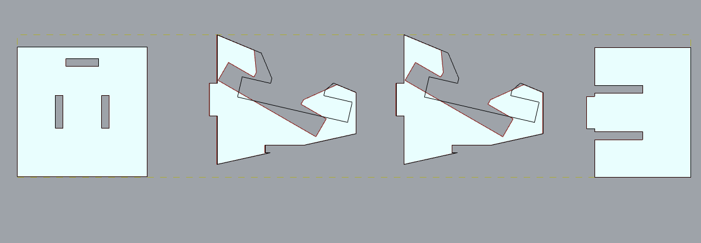

# Hi, you are reading CD3's weekly progress reports :)
by Wanlun Ding, TDF fall 2023, MDes'24

## Report 1 - Week of 08/31/2023 #

### Process Doc & Assessment

In the first week, I delved into the realm of parametric design using Rhino 3D and Grasshopper 3D... 

👀 I resized the table based on the desk at my home, adjusted the human figure to my height, and set the phone's dimensions and camera positions according to the iPhone 11 Pro Max model.

However, I wasn't able to find the slider to move the phone on the table, thus turning to move the student's positioni instead.

The final laser-cut design results in misplaced, non-overlapped shapes and lines, which didn't happen for before some slider adjustments. In addition, I could not find where and how to bake the 2D design after changes, thus questioning if I accidentally moved the outline. I wonder if this would affect the export to Illustrator and laser cutting.

### Reflections (what and how I learned)

🤯 Though having played with Rhino modeling a few years ago, I used it primarily for grasping 3D concepts rather than precision. This became evident when my attempt to export a design for laser cutting resulted in ill-fitting pieces back then. Reopening Rhino years later, I faced a steep relearning curve of the interface.
- I could not understand the blank viewports in the beginning, the unselectable geometries, and the baking concept until I read [this article](https://modelab.gitbooks.io/grasshopper-primer/content/1-foundations/1-1/3_talking-to-rhino.html) explaining how Grasshopper communicates with Rhino.

  - 🍰 _**Baking**_
is like turning a recipe into a dish. Grasshopper designs provide rules for Rhino to follow, but it doesn't actually create any real objects by itself. When you want to use Grasshopper-designed shapes in Rhino, like selecting, editing, or transforming, you must "bake" them. Baking is like taking a snapshot of your Grasshopper design and making it real in the Rhino world. Once you've baked something, it becomes part of your Rhino project and won't change automatically if you change your Grasshopper instructions.

🪩 Though I only tested the tools with ready-made sliders of parameters guiding the ultimate 2D and 3D designs, the project turned out more constructive when I took a step back to consider the qualitative decisions about parameters. 

- I questioned the elements making up the current context: the CellPhoneStand_all file included various basic components like the floor, table, student user, phone screen, camera, and lens view. These were assembled to create a functional stand for shooting videos. The central focus was on accurately representing the user's actions, considering how the student's body and the table's geometry interacted with the phone's lens view.
  
- By searching "qualitative computational design," I came across a study, [HUMANISING THE COMPUTATIONAL DESIGN PROCESS Integrating Parametric Models with Qualitative Dimensions](https://papers.cumincad.org/data/works/att/ascaad2016_003.pdf), that discusses social and cultural contextual aspects. This analysis prepared:
    > "Socio-spatial grammar for generating parametric solutions for contemporary tall residential buildings that encourage social interaction between families, while respecting their needs, lifestyles and context."
    
- To rethink the system of parameters while observing."how the current components are connected (without much understanding of how they are designed), I noted down a few components that could personalize the solution inspired by the article mentioned above and my real-life situation:

  - Design for multiple shooting perspectives in a confined space. For instance, I have an L-shaped desk at home that can support shooting from either direction (as illustrated below). Although the table's dimensions may not matter much, the room layout could affect the lens view depth and other camera components. How far or close does the user usually stay from the phone, given the limits of the room or the best shooting distance? The floor is set to be a regular rectangular platform whereas, in a real user scenario, there could be irregular layouts, furniture blocks, and other factors (e.g., the user starts a knitting YouTube channel but does not want roommates or parents to find out about the video shooting, thus needing to find a spot that allows the user to quickly stop and "cover the scene" when others ask to enter the room).
   
   
   - Consider more contextual data and user preferences. Where are the windows, and where does the best natural lighting come in? Is the generated design suitable for users with various difficulties in vision, mobility, etc.? Is the computational model powerful enough to inform such accessible design? Is it possible to lay the foundation for a further manually modified design intended for enjoyment beyond usability?

  - How is parametric design more or less suitable for designing different user scenarios compared to generative and algorithmic design? In what cases should I generate a collection of designs or seek one solution? How does the quantity of produced designs or the algorithmic process "in the black box" affect the ideal working method of evaluating results? I would revisit these questions after printing and laser cutting the designs and as I explore computational design and the 3D tools more.  

✅ Next thing for gaining knowledge of Rhino and Grasshopper includes: 
- Learn the [Rhino](http://docs.mcneel.com/rhino/7/help/en-us/commandlist/command_list.htm) and [Grasshopper](http://docs.mcneel.com/rhino/7/help/en-us/commands/grasshopper.htm) command list and vocabulary for better communication and understanding (sources linked).

### Speculations (tools, work, and news)

🤖 As a neophyte, I (of course) asked ChatGPT about the parameters helpful for generating a good phone stand design. Here is a list in which I highlighted the design opportunities I missed. I would like to learn if and how Grasshopper can incorporate these factors. While I assumed the aesthetics-related ones would be more difficult for AI or computing to solve, I also wondered if the other aspects could be successfully translated into feasible numeric parameters. For example, when considering portability or easy assembly, should the design consist of smooth edges and corners so that users won't get hurt or experience damage to their belongings kept together with the stand? How does a designer communicate this consideration with the tools? 

1. User ergonomics and comfort
2. Table dimensions and stability
3. Camera angle and view
4. Lighting conditions
5. Phone model and size
6. Material and aesthetics
7. 🚶 _**Portability and storage**_
8. 🔌 _**Cable management**_
9. Hands-free operation
10. Ease of assembly and customization
11. Stability and vibration damping
12. 🛋 _**Contextual aesthetics**_

🧙 Furthermore, imagine if users can all adjust the parameters through a designed AI-powered interface without interacting with the complex tool and 3D print the product from home; how can they give feedback, and what feedback data are needed for improvements once they try it out? I researched and discovered the seemingly contradictory yet promising paring of a concept, "mass customization" through [this article](https://t.ly/cXR72). I was thinking more about design for highly personalized fit, especially in the realm of healthcare, fitness, everyday safety equipment. The applications can be more creative and aesthetics-oriented. But what does creativity even mean with computational design? Is leveraging computational design to design a medical device necessarily a less creative process than to produce a fashionable keychain? For the final thought, please see some of my product findings below, all of which I appreciated and learned a lot from. 

[Nike's performance-enhancing 3D-printed sneakers](https://techcrunch.com/2018/04/17/nikes-vaporfly-elite-flyprint-leans-hard-into-computational-design/?guccounter=1&guce_referrer=aHR0cHM6Ly93d3cuZ29vZ2xlLmNvbS8&guce_referrer_sig=AQAAAJBe7TnddiJgDio7OvVoDagrGf23X6nx3oG5ThJ0FRdxpAO7B5zww0oY1lIRXQj6QAGVKdMucl7uy_gx47RHG-IMkZCCEuBQ3o0y2SucEpd2o_z6-z-PUvvcn4foGm5vVeZmBkXIdxZda-9Z3HGBwUenSb-hpoTTzX8b30YepGwu)

[Personomic's maximum comfort custom-made bike grips](https://personomic.de/en/products/bike-grips)

[Nik Lee's bubble boots idea by AI](https://nikleedesign.com/bubble-boots)

🤓 Thanks for reading.
