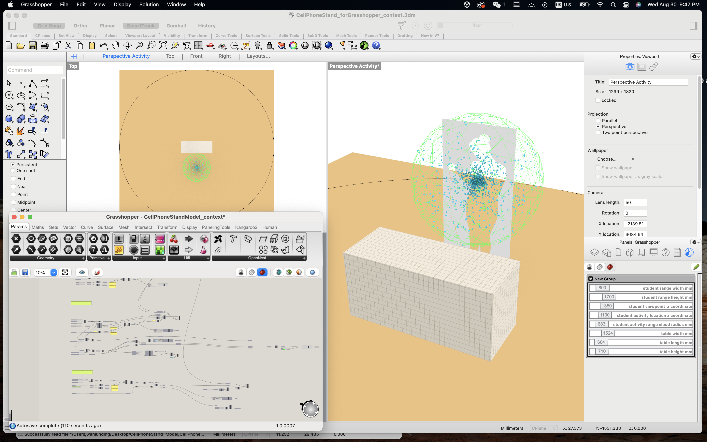

# Hi, you are reading CD3's weekly progress reports :)
by Wanlun Ding, TDF fall 2023, MDes'24

## Report 1 - Week of 08/31/2023 #

### Process Doc & Assessment

In the first week, I delved into the realm of parametric design using Rhino 3D and Grasshopper 3D... 

### Reflections (what and how I learned)

🤯 Though having played with Rhino modeling a few years ago, I used it primarily for grasping 3D concepts rather than precision. This became evident when my attempt to export a design for laser cutting resulted in ill-fitting pieces back then. Reopening Rhino years later, I faced a steep relearning curve of the interface and could not understand the blank viewports in the beginning, the unselectable geometries, and the baking concept, until I read [this article](https://modelab.gitbooks.io/grasshopper-primer/content/1-foundations/1-1/3_talking-to-rhino.html) explaining how Grasshopper communicates with Rhino. 

- 🍰 _**Baking**_
is like turning a recipe into a dish. Grasshopper designs provide rules for Rhino to follow, but it doesn't actually create any real objects by itself. When you want to use Grasshopper-designed shapes in Rhino, like selecting, editing, or transforming, you need to "bake" them. Baking is like taking a snapshot of your Grasshopper design and making it real in the Rhino world. Once you've baked something, it becomes an actual part of your Rhino project and won't change automatically if you make changes to your Grasshopper instructions.

✅ A set of to-dos for gaining knowledge of Rhino and Grasshopper includes: 
- Learn the [Rhino](http://docs.mcneel.com/rhino/7/help/en-us/commandlist/command_list.htm) and [Grasshopper](http://docs.mcneel.com/rhino/7/help/en-us/commands/grasshopper.htm) command list and vocabulary for better communication and understanding
- lskdjf

Though I tested the tools with ready-made sliders of parameters guiding the ultimate 2D and 3D designs, the project turned out more productive and constructive when I also took a step back to consider the 

reflect on the experience of exploring a procedural model whose output is a cell phone stand design in Rhino
Consider: What other contextual observations would be useful to capture?
Consider: What other evaluations of results would be useful to provide as feedback?

### Speculations (tools, work, and news)
* speculation on future direction for the tools [so much is changing very quickly right now, where do you think this is going? Why do you think this?]
* speculation on future direction for the work
* bonus: thoughtful descriptions of something interesting and relevant you heard about in the news or industry publications. include text, an image, a link, and a reference that you can follow up on later and share with your peers.

* Consider: Are there points in the process where you think AI…
Could be used to assist?
Could be trained on input and output?
Other?

